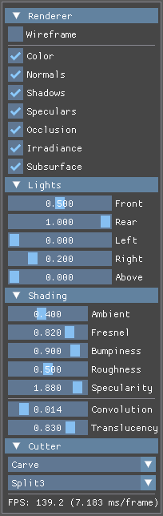

<!-- markdownlint-disable MD033 -->

# SkinCut

Real-Time Simulation and Visualization of Cutting Wounds  
Maurits Lam  
2025

<p align="center">
   
</p>

**SkinCut** is a real-time wound simulation and visualization system that combines mesh cutting algorithms with advanced skin rendering techniques. Built on C++ and DirectX 11, it enables interactive creation of natural-looking cutting wounds through dynamic geometry generation and procedural texture synthesis for applications in computer graphics and medical simulation.

This project implements the research presented in the master thesis [Real-time Simulation and Visualization of Cutting Wounds](https://studenttheses.uu.nl/handle/20.500.12932/22174) by Maurits Lam at Utrecht University.

The work addresses the gap between medical simulation (minimal visualization) and game graphics (artistic-driven) by developing a complete system that combines mesh cutting simulation with skin visualization techniques to synthesize cutting wounds in real time. The approach includes a novel remeshing scheme that maintains topology and parameterization during interactive cut creation, procedural wound appearance generation, and an extension to subsurface scattering for local skin discoloration.

## Key Features

- **Real-Time Mesh Cutting**: Interactive cutting line integration with topology-preserving remeshing.
- **Procedural Wound Generation**: Dynamic geometry and texture creation for realistic wound appearance.
- **Advanced Skin Rendering**: Physically-based skin shading reflectance model using [Kelemen/Szirmay-Kalos BRDF](http://www.hungrycat.hu/microfacet.pdf) and [Separable Subsurface Scattering](https://www.iryoku.com/separable-sss/downloads/Separable-Subsurface-Scattering.pdf) with local discoloration.
- **Interactive Subdivision**: Adaptive mesh refinement with 3-split, 4-split, and 6-split modes.
- **Performance Optimized**: ~50ms cutting operations, ~2.5ms frame rendering on mid-range hardware.

## User Guide

### Running the Application

#### Basic Launch

```cmd
SkinCut.exe
```

Launches with default configuration using the `Resources/` directory.

#### Custom Resource Path

```cmd
SkinCut.exe "C:\SkinCutResources\Project1\"
```

Specify an alternate resource directory. Path can be relative or absolute.

The application expects the following resource directory structure:

```text
ResourceFolder/
├── Config.json         # Rendering and interaction settings
├── Scene.json          # Scene definition and lighting setup
├── Models/             # 3D meshes and textures
│   ├── Head.obj        # Default 3D model
│   ├── Color.dds       # Base color texture
│   ├── Normal.dds      # Normal map for surface detail
│   ├── Specular.dds    # Specular reflection map
│   ├── Discolor.dds    # Discoloration map for wound effects
│   └── Occlusion.dds   # Ambient occlusion map
├── Textures/           # Additional texture resources
└── Fonts/              # UI font files
```

### User Interface

The SkinCut interface consists of several panels that can be toggled and configured:



- **Renderer Toggles**: Enable/disable wireframe, shadows, speculars, occlusion, etc.
- **Light Controls**: Modify individual light intensities and colors.
- **Material Parameters**: Adjust ambient, fresnel, roughness, bumpiness, specularity.
- **Subsurface Scattering**: Control convolution and translucency for realistic skin rendering.
- **Pick Mode**: Current cutting mode (paint/merge/carve).
- **Split Mode**: Current splitting/subdivision mode (split3/split4/split6).

### Controls

#### Mouse Controls

| Action                   | Description                                                              |
|--------------------------|--------------------------------------------------------------------------|
| **Left Mouse Drag**      | Hold and drag to orbit around model.                                     |
| **Right Mouse Drag**     | Hold and drag to pan camera.                                             |
| **Mouse Wheel Scroll**   | Scroll up and down to zoom in and out.                                   |
| **Middle Mouse Click**   | Select cutting points on mesh surface between which a cut should appear. |

The selection points for a cut should not be too close or too far apart from each other.

Use **Shift + Middle Click** on a mesh face to see the mesh subdivision/splitting algorithm in action:

- **Split3**: Divides triangle face into 3 smaller triangles.
- **Split4**: Creates 4 triangles face with central vertex.
- **Split6**: Subdivides the target triangle face and the its three neighbors in three.

#### Keyboard Shortcuts

| Key     | Function                                                                                  |
|---------|-------------------------------------------------------------------------------------------|
| **W**   | Switch between solid and wireframe rendering.                                             |
| **R**   | Reload scene and reset all modifications, may take a few seconds.                         |
| **T**   | Run 100-iteration performance test, outputs to console.                                   |
| **F1**  | Hide/show all interface panels.                                                           |
| **ESC** | Close the application.                                                                    |

Press **T** to run comprehensive performance analysis:

- Tests 100 cutting operations across different scenarios.
- Measures each stage: line formation, patch generation, texture painting, mesh fusion, geometry opening.
- Results output to console window (keep it open to see results).
- Test duration: 2-5 minutes depending on model complexity.

## Configuration

SkinCut uses two **JSON** configuration files for scene setup and rendering parameters.

- **Scene.json**: Camera position, 3D models, lighting setup, and material properties.
- **Config.json**: Rendering settings, shader parameters, and interaction modes.

### Scene Configuration

Modify `Resources/Scene.json` for custom models and lighting:

- **Camera position**: Set initial viewpoint.
- **Model loading**: Specify 3D mesh and associated texture files.
- **Light setup**: Configure multiple light sources with position and color.

```json
{
  "camera": {
     "position":     [0.0, 0.0, 5.0]
  },
  "models": [
     {
       "name":       "Head",
       "position":   [0.0, 0.0, 0.0],
       "rotation":   [0.0, 0.0, 0.0],
       "mesh":       "Models/Head.obj",
       "color":      "Models/Color.dds",
       "normal":     "Models/Normal.dds",
       "specular":   "Models/Specular.dds",
       "discolor":   "Models/Discolor.dds",
       "occlusion":  "Models/Occlusion.dds"
     }
  ],
  "lights": [
     {
       "name":       "Front",
       "position":   [0.0, 0.0, 5.0],
       "color":      [0.5, 0.5, 0.5]
     }
  ]
}
```

### Render Configuration

Edit `Resources/Config.json` to modify default settings:

```json
{
    "color":         true,
    "bumps":         true,
    "shadows":       true,
    "speculars":     true,
    "occlusion":     true,
    "irradiance":    true,
    "scattering":    true,
    "transmittance": true,
    
    "ambient":       0.400,
    "fresnel":       0.820,
    "roughness":     0.500,
    "bumpiness":     0.900,
    "specularity":   1.880,
    "convolution":   0.014,
    "translucency":  0.830
}
```

### Troubleshooting

#### Launch Issues

- **"Unable to locate resource directory"**: Ensure the Resources folder exists and contains required files.
- **"Unable to locate config file"**: Verify `Config.json` exists in the resource directory.
- **"Unable to locate scene file"**: Verify `Scene.json` exists in the resource directory.

#### Cutting Not Working

- Ensure both points are clicked directly on mesh faces.
- Verify cut line spans at least two triangular faces.

#### Application Crashes

- Avoid placing cuts too closely to each other.
- **Critical runtime errors**: Scene corruption, press R to reload (if possible).

## Technical Implementation

### Core Algorithms

- **Mesh Cutting**: Topology-preserving cutting line integration with arbitrary cut support.
- **Wound Generation**: Procedural geometry creation with in-situ texture synthesis.
- **Subsurface Scattering**: Screen-space implementation with local discoloration support.
- **DirectX 11 Rendering**: GPU-accelerated pipeline with HLSL shaders for advanced materials.

### Performance

- **Cutting Operations**: ~50ms average per cut.
- **Frame Rendering**: ~2.5ms typical frame time.
- **Memory Efficient**: Dynamic mesh updates without full reconstruction.
- **Scalable**: Performance test framework included for validation.

## Building

### Dependencies

- [DirectXTK](https://github.com/Microsoft/DirectXTK) (October 2024) - DirectX Toolkit for rendering utilities.
- [DirectXTex](https://github.com/Microsoft/DirectXTex) (October 2024) - Texture loading and processing.
- [Dear ImGui](https://github.com/ocornut/imgui) (1.91.8) - Immediate mode GUI.
- [JSON for Modern C++](https://github.com/nlohmann/json) (3.11.3) - Configuration parsing.

### Build Instructions

#### Prerequisites

- Visual Studio 2022 or later with C++ development tools
- CMake 3.20 or later
- vcpkg package manager

#### Building with CMake

```cmd
# Clone and set up vcpkg (if not already installed)
git clone https://github.com/Microsoft/vcpkg.git
cd vcpkg
.\bootstrap-vcpkg.bat
.\vcpkg integrate install

# Set environment variable (add to system PATH permanently)
set VCPKG_ROOT=C:\path\to\vcpkg

# Build SkinCut
cd SkinCut
.\Build.bat
```

The executable will be placed in `Bin/Release/`. For detailed build instructions, see [BUILDING.md](BUILDING.md).

## File Structure

```txt
SkinCut/
├── Bin/                   # Compiled executables (generated)
├── Build/                 # CMake build files (generated)
├── Resources/             # Runtime assets and configuration
│   ├── Config.json           # Rendering and interaction settings
│   ├── Scene.json            # Scene definition and lighting
│   ├── Fonts/                # UI font resources
│   ├── Models/               # 3D meshes and textures
│   └── Textures/             # Additional texture resources
├── Shaders/               # HLSL shader programs
│   ├── Discolor.ps.hlsl      # Local skin discoloration
│   ├── Main.*.hlsl           # Kelemen/Szirmay-Kalos skin shader
│   ├── Subsurface.ps.hlsl    # Screen-space subsurface scattering
│   └── Wound.ps.hlsl         # Procedural wound texture generation
└── Source/                # C++ source code
    ├── Application.*         # Main application framework
    ├── Camera.*              # Camera controls and projection
    ├── Cutter.*              # Mesh cutting and wound generation
    ├── Entity.*              # 3D model and mesh management
    ├── Interface.*           # ImGui user interface
    ├── Math.*                # DirectXMath wrapper utilities
    ├── Renderer.*            # DirectX 11 rendering pipeline
    ├── Shader.*              # HLSL shader compilation and management
    ├── Tester.*              # Performance benchmarking
    └── Texture.*             # Texture loading and manipulation
```

## References

1. Lam, M. H. J. (2017). *Real-time simulation and visualization of cutting wounds*. Master's thesis, Utrecht University. Available at: <https://studenttheses.uu.nl/handle/20.500.12932/22174>.
2. Kelemen, C., & Szirmay‐Kalos, L. (2001). A microfacet based coupled specular‐matte BRDF model with importance sampling. *Computer Graphics Forum*, 20(4), 25-34. Blackwell Publishers. Available at <http://www.hungrycat.hu/microfacet.pdf>.
3. Jimenez, J., Sundstedt, V., & Gutierrez, D. (2009). Screen-space perceptual rendering of human skin. *ACM Transactions on Applied Perception*, 6(4), 1-15. Available at <https://www.iryoku.com/separable-sss/downloads/Separable-Subsurface-Scattering.pdf>.
4. Microsoft Corporation. (2024). *DirectX 11 Programming Guide*. Microsoft Developer Documentation. Available at: <https://docs.microsoft.com/en-us/windows/win32/direct3d11>.
5. Walbourn, C. (2024). *DirectX Tool Kit for DirectX 11*. Microsoft GitHub Repository. Available at: <https://github.com/Microsoft/DirectXTK>.
6. Walbourn, C. (2024). *DirectXTex texture processing library*. Microsoft GitHub Repository. Available at: <https://github.com/Microsoft/DirectXTex>.
7. Cornut, O. (2024). *Dear ImGui: Bloat-free Graphical User interface for C++ with minimal dependencies*. GitHub Repository. Available at: <https://github.com/ocornut/imgui>.
8. Lohmann, N. (2024). *JSON for Modern C++*. GitHub Repository. Available at: <https://github.com/nlohmann/json>.

## License

This software is licensed under the [GNU General Public License v3.0](https://www.gnu.org/licenses/gpl-3.0.html). See [COPYING](COPYING) for details.
